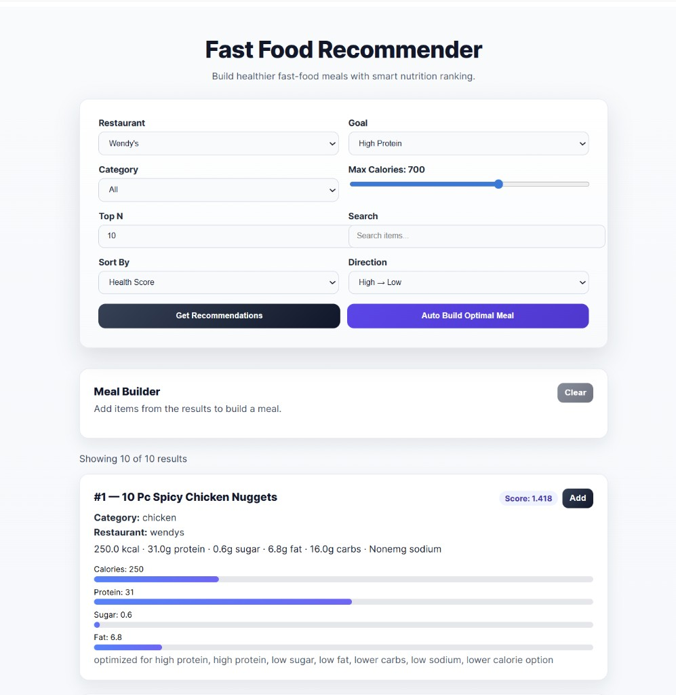
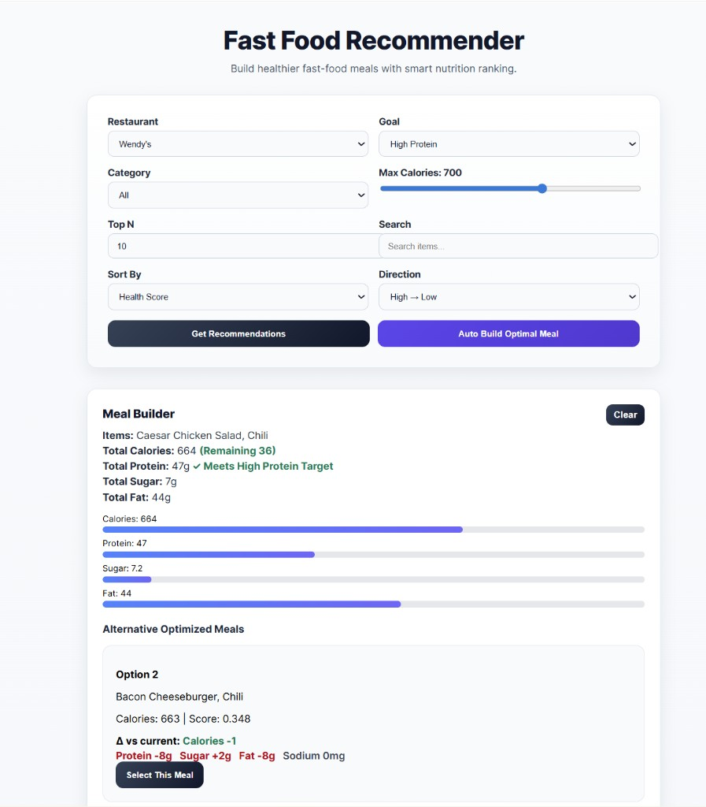

# Crave - Fast Food Recommender

Crave is a full-stack nutrition recommendation app that helps users build healthier fast-food meals across major restaurants. It ranks menu items by goal-aligned health score and can automatically generate optimized meal combinations under calorie limits.

## Portfolio Snapshot

- **Project Type:** Full-stack web application
- **Problem Solved:** Makes healthier fast-food choices easier with goal-based ranking and meal optimization
- **Core Value:** Turns raw nutrition data into practical, personalized recommendations

## Resume-Style Highlights

- Built a production-deployed full-stack app using React (Vite) and FastAPI, with separate frontend/backend hosting.
- Designed a nutrition scoring workflow that ranks menu items by user goals (balanced, high protein, low sugar, low fat).
- Implemented constrained meal optimization to auto-generate top meal combinations under calorie limits.
- Added interactive filtering, sorting, and meal-comparison UX to improve user decision-making.

## Live Demo

- Frontend (Vercel): [https://fast-food-ui.vercel.app](https://fast-food-ui.vercel.app)
- Backend API (Render): [https://crave-2jtg.onrender.com](https://crave-2jtg.onrender.com)

## Features

- Multi-restaurant support (McDonald's, Chick-fil-A, Wendy's, Taco Bell, Burger King, or all)
- Goal-based recommendation modes:
  - Balanced
  - High Protein
  - Low Sugar
  - Low Fat
- Adjustable calorie cap and top-N ranking
- Search and sorting for recommendation results
- Meal Builder with nutrition totals and progress bars
- Auto-build optimized meal combinations
- Alternative optimized meal options with metric deltas vs current meal

## Tech Stack

- Frontend: React, Vite, CSS
- Backend: FastAPI, Uvicorn, Python
- Hosting:
  - Frontend: Vercel
  - Backend: Render

## Architecture

```text
Crave/
|- fast-food-ui/   # React frontend (UI and API calls)
|- ingest/         # FastAPI backend + recommendation logic + datasets
|- render.yaml     # Render infrastructure configuration
```

Flow:
1. User sets preferences in frontend (restaurant, goal, calories, filters).
2. Frontend calls backend endpoints (`/recommend` or `/optimize_meal`).
3. Backend scores/filters/optimizes and returns structured meal data.
4. Frontend renders cards, nutrition bars, and meal comparisons.

## API Endpoints

Base URL: `https://crave-2jtg.onrender.com`

- `GET /recommend`
  - Query params: `restaurant`, `max_calories`, `top_n`, `goal`, `category`, `format`
- `GET /optimize_meal`
  - Query params: `restaurant`, `max_calories`, `goal`, `category`, `allow_side`, `allow_drink`, `format`

## Local Development

### 1) Run backend

```bash
cd ingest
pip install -r requirements.txt
python -m uvicorn api:app --reload
```

Backend runs at `http://127.0.0.1:8000`

### 2) Run frontend

```bash
cd fast-food-ui
npm install
npm run dev
```

Frontend runs at `http://localhost:5173`

Create `fast-food-ui/.env`:

```env
VITE_API_BASE_URL=http://127.0.0.1:8000
```

## Testing & CI

GitHub Actions (`.github/workflows/ci.yml`) runs on every push to `main` and on pull
requests, with two jobs:

- **backend** — `pip install`, `python -c "import api"`, then `pytest`
  (`ingest/test_scoring.py` scoring math + `ingest/test_api.py` endpoint/optimizer tests).
- **frontend** — `npm ci`, `npm run lint`, `npm run build`.

Run the same checks locally:

```bash
cd ingest && pip install -r requirements.txt && python -m pytest -q
cd fast-food-ui && npm run lint && npm run build
```

Design specs for major changes live in `docs/superpowers/specs/`.

## Deployment Notes

Two environment variables wire the two halves together. See `ingest/.env.example` and
`fast-food-ui/.env.example` for templates.

| Variable | Set in | Production value | Symptom if wrong/missing |
| --- | --- | --- | --- |
| `VITE_API_BASE_URL` | Vercel (frontend) | `https://crave-2jtg.onrender.com` | Frontend falls back to `http://127.0.0.1:8000` and shows no data in production |
| `CORS_ORIGINS` | Render (backend) | `https://fast-food-ui.vercel.app` | Browser blocks every API call with a CORS error; UI silently empty |

`GET /health` returns dataset counts and is a good uptime/readiness probe.

## Screenshots / Demo Media
### Recommendations View



### Meal Optimizer View



## What I Learned

- How to structure frontend/backend deployment with environment-based API routing.
- How to translate nutrition goals into weighted scoring and practical constraints.
- How to design UI feedback that explains trade-offs (calories vs protein/sugar/fat).

## Future Improvements

- Add authentication and saved meal plans
- Add more restaurant datasets
- Add frontend component tests (backend unit + API/integration tests are in place)
- Add caching and performance profiling
- Accessibility improvements (dark mode shipped)

## Author

- Name: `Rohan Shetty`
- LinkedIn: `https://www.linkedin.com/in/rohan-shetty-525a61248/`
- GitHub: `https://github.com/roshet`

